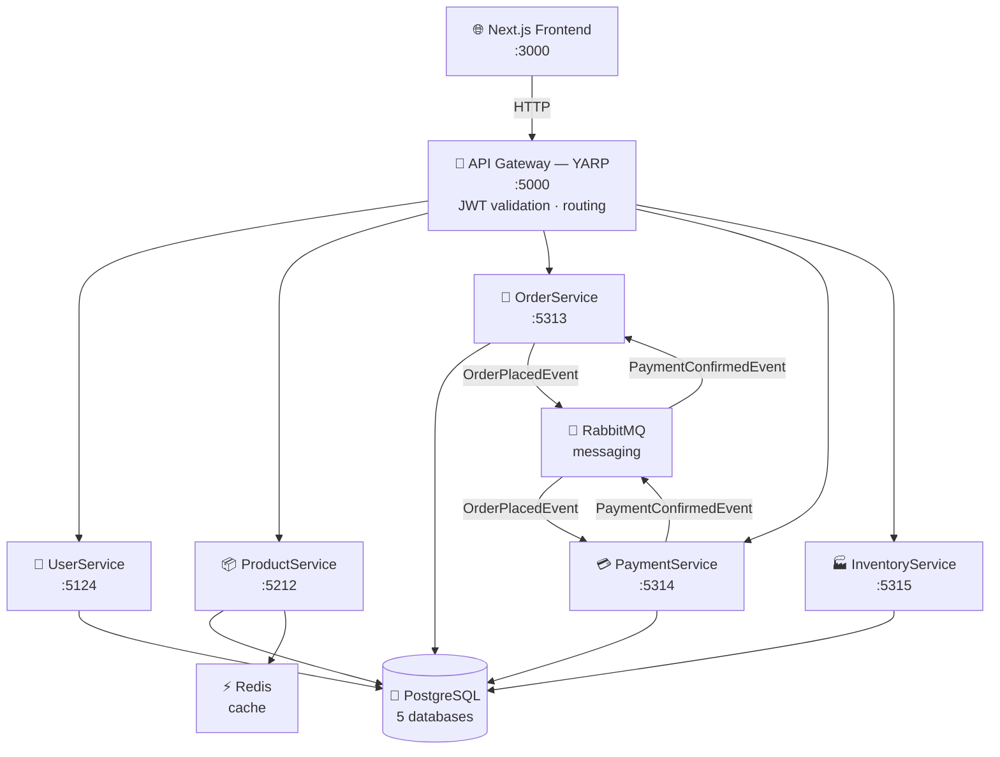
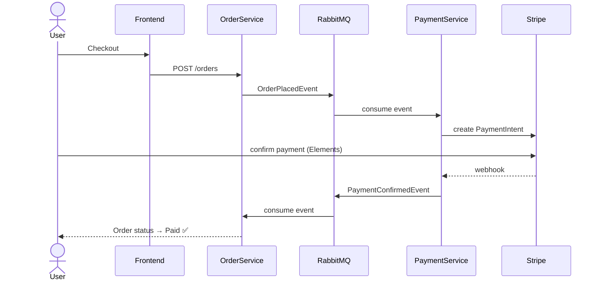
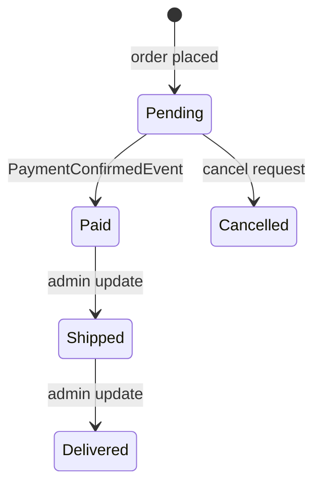

<h1 align="center">🛍️ ECommerce Platform</h1>

<p align="center">
  A production-style <strong>microservices e-commerce platform</strong> built from scratch with .NET 10, Next.js, PostgreSQL, RabbitMQ, Redis, Stripe, and Docker.
</p>

<p align="center">
  
  
  
  
  
  
  
  
</p>

---

## Architecture



---

## Async Messaging Flow



---

## Order State Machine



---

## Services

| Service | Port | Responsibility |
|---|---|---|
| **ApiGateway** | 5000 | YARP reverse proxy, JWT auth middleware |
| **UserService** | 5124 | Registration, login, JWT issuing, BCrypt hashing |
| **ProductService** | 5212 | Product catalog, categories, Redis caching |
| **OrderService** | 5313 | Order lifecycle state machine |
| **PaymentService** | 5314 | Stripe PaymentIntents, webhook handling |
| **InventoryService** | 5315 | Stock seeding, adjustment, underflow protection |

---

## Tech Stack

| Layer | Technology |
|---|---|
| Backend | .NET 10 · C# 14 · ASP.NET Core Web API |
| ORM | Entity Framework Core 10 · Npgsql |
| Database | PostgreSQL 16 (one DB per service) |
| Messaging | RabbitMQ 3 · MassTransit 8 |
| Caching | Redis 7 · `IDistributedCache` |
| Auth | JWT HS256 · BCrypt.Net |
| Payments | Stripe.net (PaymentIntents + webhooks) |
| Gateway | YARP (Yet Another Reverse Proxy) |
| Frontend | Next.js 16 · Turbopack · Tailwind CSS · Stripe Elements |
| Tests | xUnit 2.9.3 · Moq 4 · EF Core InMemory |
| Infra | Docker · Docker Compose |

---

## Quick Start

### Prerequisites
- [Docker Desktop](https://www.docker.com/products/docker-desktop/)
- [.NET 10 SDK](https://dotnet.microsoft.com/download)
- [Node.js 20+](https://nodejs.org/)

### 1. Configure secrets

```bash
cp .env.example .env
# Edit .env and fill in:
#   Jwt__Secret           → any long random string
#   Stripe__SecretKey     → sk_test_...
#   Stripe__WebhookSecret → whsec_...
#   Stripe__Currency      → usd
```

### 2. Start all backend services

```bash
docker compose up -d
```

All databases are auto-created via numbered init SQL files in `docker/postgres/init/`.

### 3. Apply EF Core migrations

```bash
dotnet ef database update --project UserService
dotnet ef database update --project ProductService
dotnet ef database update --project OrderService
dotnet ef database update --project PaymentService
dotnet ef database update --project InventoryService
```

### 4. Start the frontend

```bash
cd frontend/ecommerce-web
npm install
npm run dev
```

Open [http://localhost:3000](http://localhost:3000)

---

## 🎮 Cheat Codes

> Copy-paste ready commands for every situation.

### Build

```bash
# Build everything
dotnet build

# Build one service
dotnet build UserService

# Build in Release mode
dotnet build --configuration Release
```

### Run (without Docker)

```bash
# Run a single service locally
dotnet run --project UserService
dotnet run --project ProductService
dotnet run --project OrderService
dotnet run --project PaymentService
dotnet run --project InventoryService
dotnet run --project ApiGateway

# Run with hot reload (watches for file changes)
dotnet watch --project OrderService
```

### Test

```bash
# Run all 73 tests
dotnet test

# Show each test name as it runs (great for demos)
dotnet test --logger "console;verbosity=normal"

# Run tests for one service only
dotnet test UserService.Tests
dotnet test OrderService.Tests
dotnet test ProductService.Tests
dotnet test PaymentService.Tests
dotnet test InventoryService.Tests

# Run tests + show coverage summary
dotnet test --collect:"XPlat Code Coverage"
```

### Docker

```bash
# Start all services in the background
docker compose up -d

# Start and stream logs to the terminal
docker compose up

# Start only specific services
docker compose up -d postgres rabbitmq redis

# Rebuild images and start (use after code changes)
docker compose up -d --build

# Rebuild one service image
docker compose build orderservice

# Stop everything (keeps data volumes)
docker compose down

# View live logs for all services
docker compose logs -f

# View logs for one service
docker compose logs -f paymentservice

# Check what's running
docker compose ps
```

### Database / Migrations

```bash
# Add a new migration
dotnet ef migrations add YourMigrationName --project OrderService

# Apply migrations to the DB
dotnet ef database update --project OrderService

# List all migrations
dotnet ef migrations list --project OrderService

# Remove last migration (if not applied yet)
dotnet ef migrations remove --project OrderService
```

### Git

```bash
# Stay in sync before starting work
git fetch origin
git pull --rebase origin main

# Stage everything and commit
git add -A
git commit -m "feat: your message here"

# Push to both branches
git push origin main
git push origin main:master
```

### Useful Docker One-Liners

```bash
# Open a shell inside a running container
docker exec -it ecommerce-postgres psql -U postgres

# List all databases in Postgres
docker exec -it ecommerce-postgres psql -U postgres -c "\l"

# Check RabbitMQ queues (also available at http://localhost:15672)
docker exec -it ecommerce-rabbitmq rabbitmqctl list_queues

# Flush Redis cache
docker exec -it ecommerce-redis redis-cli FLUSHALL
```

---

## API Overview

All routes go through the gateway at `http://localhost:5000`.

### Auth (`/api/auth`)
| Method | Route | Description |
|---|---|---|
| POST | `/api/auth/register` | Register new user |
| POST | `/api/auth/login` | Login → JWT |
| GET | `/api/auth/profile` | Get own profile (auth) |
| PUT | `/api/auth/change-role` | Change user role (admin) |

### Products (`/api/products`)
| Method | Route | Description |
|---|---|---|
| GET | `/api/products` | List products (pagination + search) |
| GET | `/api/products/{id}` | Get product (Redis-cached) |
| POST | `/api/products` | Create product (admin) |
| PUT | `/api/products/{id}` | Update product (admin) |
| DELETE | `/api/products/{id}` | Delete product (admin) |
| GET | `/api/products/categories` | List categories |

### Orders (`/api/orders`)
| Method | Route | Description |
|---|---|---|
| POST | `/api/orders` | Place order |
| GET | `/api/orders/{id}` | Get order by ID |
| GET | `/api/orders/user/{userId}` | Get user's orders |
| GET | `/api/orders` | List all orders (admin) |
| PUT | `/api/orders/{id}/status` | Update status (admin) |
| DELETE | `/api/orders/{id}` | Cancel order |

### Payments (`/api/payments`)
| Method | Route | Description |
|---|---|---|
| POST | `/api/payments` | Create Stripe PaymentIntent |
| POST | `/api/payments/pending` | Create pending payment record |
| GET | `/api/payments/{id}` | Get payment |
| GET | `/api/payments/order/{orderId}` | Get by order |
| GET | `/api/payments/user/{userId}` | Get user's payments |
| POST | `/api/payments/order/{orderId}/confirm` | Confirm payment + publish event |
| POST | `/api/payments/webhook` | Stripe webhook handler |

### Inventory (`/api/inventory`)
| Method | Route | Description |
|---|---|---|
| POST | `/api/inventory/{productId}/seed` | Seed initial stock |
| GET | `/api/inventory/{productId}` | Get stock level |
| PATCH | `/api/inventory/{productId}/adjust` | Adjust stock (±delta) |

---

## Testing

73 unit tests across all 5 services using **xUnit + Moq + EF Core InMemory**.

```bash
dotnet test --logger "console;verbosity=normal"
```

```
Passed!  - Failed: 0, Passed: 19, Total: 19  UserService.Tests
Passed!  - Failed: 0, Passed: 17, Total: 17  OrderService.Tests
Passed!  - Failed: 0, Passed: 17, Total: 17  ProductService.Tests
Passed!  - Failed: 0, Passed: 10, Total: 10  PaymentService.Tests
Passed!  - Failed: 0, Passed: 10, Total: 10  InventoryService.Tests
```

---

## Project Structure

```
ECommerce/
├── ApiGateway/              # YARP reverse proxy
├── UserService/             # Auth & user management
├── ProductService/          # Product catalog + Redis cache
├── OrderService/            # Order state machine
├── PaymentService/          # Stripe integration
├── InventoryService/        # Stock management
├── Ecommerce.Messaging/     # Shared MassTransit event contracts
├── *Service.Tests/          # xUnit test projects (one per service)
├── frontend/
│   └── ecommerce-web/       # Next.js 16 storefront
├── docker/
│   └── postgres/init/       # Numbered SQL init scripts
└── docker-compose.yml
```

---

<p align="center">Built with ☕ and a lot of <code>dotnet build</code></p>
